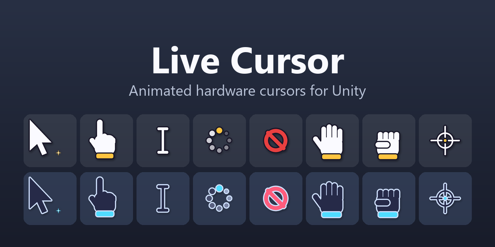

# Live Cursor



Animated hardware (OS) cursors for Unity with zero added input lag: looping cursor states, authored transitions
that play in reverse and turn around mid-way, per-state click points, and a builder that turns a folder of frames
into a cursor set.

The package lives in [`Packages/com.opportunv.live-cursor`](Packages/com.opportunv.live-cursor). Its
[README](Packages/com.opportunv.live-cursor/README.md) is the manual.

## Installation

In **Window > Package Manager**, choose **+ > Install package from git URL** and enter:

```
https://github.com/OpportunV/LiveCursor.git?path=Packages/com.opportunv.live-cursor
```

Append a tag, for example `#v0.1.0`, to pin a release.

## This repository

The repository is the Unity project used to develop the package:

- `Packages/com.opportunv.live-cursor`: the package, with its tests and the Demo sample.
- `Assets/LiveCursorSamples`: the editable source of the Demo sample.
- `Assets/Dev`: development tools (demo scene builder, sample exporter, diagnostics).
- `Tools`: scripts that generate the demo cursor art and this preview image.

Open it with Unity 6000.0 or newer.

## License

MIT. See [LICENSE.md](Packages/com.opportunv.live-cursor/LICENSE.md).
